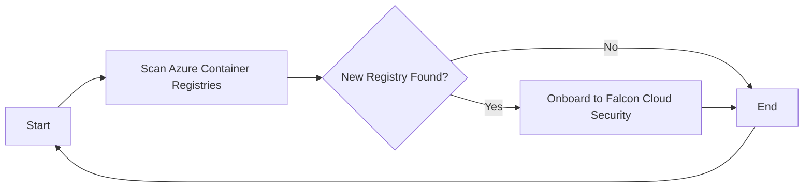
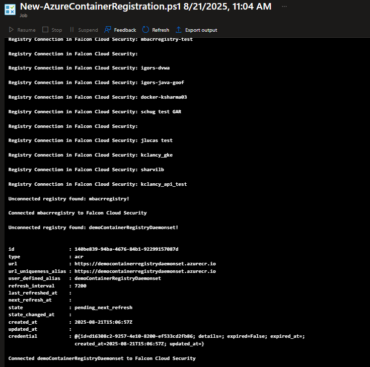

# Deployment Overview - Azure Container Registry with Falcon Cloud Security

This repository contains resources to deploy an automation framework to on-board Azure Container Registries to Falcon Cloud Security. The `main.bicep` file is the primary deployment template that provisions the necessary Azure resources.

## Resources Deployed

The `main.bicep` template deploys the following resources:

- **Resource Group**
- **Azure Automation Account**
- **Automation Account Runbook**
- **Automation Account Schedule**
- **Automation Account Modules for PSFalcon**
- **Key Vault**
- **Key Vault Secrets**

## PSFalcon PowerShell Module

The solution leverages the PSFalcon PowerShell module to interact with Falcon Cloud Security.
[PSFalcon Module](https://github.com/CrowdStrike/psfalcon)

## Deployment Options

You can deploy the resources using the Azure portal UI or Azure Government portal UI.

| Deployment Type | Link |
|:--|:--|
| Azure Commercial |  |
| Azure Government |  |

## Prerequisites

Before deploying the resources, ensure you have the following:

- An active Azure subscription.
- Sufficient permissions to create resources in the target subscription.
- API Client with permissions to on-board to image assessment in Falcon Cloud Security 

## Deployment Steps

1. Click on the appropriate deployment button above.
2. Follow the prompts in the Azure portal to complete the deployment.

## Example Output in Runbook

## Post-Deployment

After the deployment is complete, the automation account will run on a schedule. When new Azure Container Registries are found in your subscription they will be on-boarded to Falcon Cloud Security. By default the schedule is set to run every one hour.

## Contributing

Contributions are welcome! Please submit a pull request or open an issue to discuss any changes.

## License

This project is licensed under the MIT License. See the [LICENSE](LICENSE) file for details.
