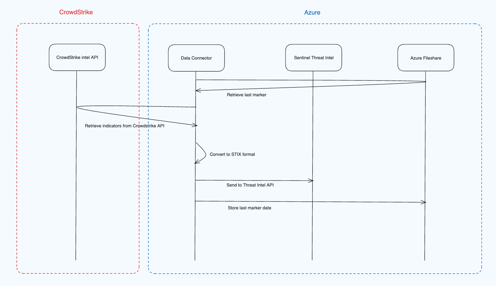

# CrowdStrike Falcon Adversary Intelligence (IOC)

## Technical Data

This data connector imports Falcon IOCs into the Threat Intelligence upload indicators API on Microsoft Sentinel. The data connector is deployed as an Azure Function using an ARM template.

### Data Flow

- The function checks if there is an existing "_marker" in the file share. Using the marker, it queries the CrowdStrike Intel endpoint `/intel/combined/indicators/v1` for indicators based on the indicators type provided in the configuration. If there is no marker present, this means that it's the first execution, at which point a date will be used to retrieve the indicators based on the updated date. This date is derived by the `LookBackDays` value provided in the configuration.
- Once a batch of 100 indicators has been retrieved from the api, the function converts the indicators to STIX 2.1 format using the mapping below

#### Crowdstrike IOC to STIX Mapping

| Crowdstrike Indicator | Stix Format    | Comments                                                                          |
| --------------------- | -------------- | --------------------------------------------------------------------------------- |
| published_date        | created        |                                                                                   |
|                       | description    |                                                                                   |
|                       | id             | hardcoded: indicator--\<UUIDv4\>                                                  |
| type                  | indicator_type |                                                                                   |
|                       | labels         |                                                                                   |
| last_updated          | modified       |                                                                                   |
| indicator             | name           |                                                                                   |
|                       | pattern        | derived using `type` (ie:file-object:hashes.md5:838eb145bfa5c04a7077d43cd77642c5) |
|                       | pattern_type   | "stix"                                                                            |
|                       | spec_version   | "2.1"                                                                             |
|                       | type           | "indicator"                                                                       |
| published_date        | valid_from     |                                                                                   |
|                       | confidence     | malicious_confidence: "high" = 80, "medium" = 60, "low" = 30, "other" = 10        |
| kill_chain_phases     | killchain      |                                                                                   |
| indicator_types       | threat_types   |                                                                                   |
| label\.name           | labels         |                                                                                   |

#### CrowdStrike Indicator types to STIX pattern

| CrowdStrike Indicator Type | STIX Pattern              |
|---------------------------|----------------------------|
| hash_md5                  | file:hashes.MD5            |
| hash_sha256               | file:hashes.'SHA-256'      |
| hash_sha1                 | file:hashes.'SHA-1'        |
| url                       | url:value                  |
| domain                    | domain-name:value          |
| ip_address                | ipv4-addr:value            |
| mutex_name                | mutex:name                 |
| password                  | user-account:credential    |
| file_name                 | file:name                  |
| email_address             | email-addr:value           |
| username                  | user-account:account_login |
| persona_name              | user-account:display_name  |
| ip_address_block          | ipv4-addr:value            |
| coin_address              | x-wallet-addr:value        |
| bitcoin_address           | x-wallet-addr:value        |

- Once all indicators have been mapped, they're uploaded to Sentinel Threat Intelligence using the [Threat Intel upload indicators API](https://learn.microsoft.com/en-us/azure/sentinel/upload-indicators-api).

### Configuration

The following parameters are required for the ARM template top be deployed.

- FunctionName - A name to be given to the Azure Function App. Default is 'CSFalconIOC'
- CrowdStrikeClientId - The client id of the credentials generated in the CrowdStrike console
- CrowdStrikeClientSecret - The client secret of the credentials generated in the CrowdStrike console
- CrowdStrikeBaseUrl - The base url of the region in which the CrowdStrike credentials were generated
- WorkspaceId - The respective workspace ID of the Microsoft Sentinel deployment
- TenantId - The tenant ID in which Microsoft Sentinel is deployed
- Indicators - The indicator types to fetch from CrowdStrike. The default is all indicators, but can be modified to cut down on the volume of indicator.
- AadClientId - The client id of the Entra App that will be used to communicate with the upload indicators API
- AadClientSecret - The client secret of the Entra App that will be used to communicate with the upload indicators API
- LookBackDays - How many days worth of indicator history should be fetched on the first execution. There is required a minimum of 1, and a maximum of 60. Due to the potential volume of indicators, the max look back period has to be capped at 60 days.
- AppInsightsWorkspaceResourceId - Resource ID for an existing log analytics workspace for the Azure Function to use.

## Requirements

To integrate with CrowdStrike Falcon Adversary Intelligence make sure you have:

**Workspace:** read and write permissions on the workspace are required.

**Keys:** read permissions to shared keys for the workspace are required. [See the documentation to learn more about workspace keys](https://learn.microsoft.com/en-us/azure/azure-monitor/agents/agent-windows?WT.mc_id=Portal-fx&tabs=setup-wizard#obtain-workspace-id-and-key).

**Microsoft\.Web\/sites permissions:** Read and write permissions to Azure Functions to create a Function App is required. [See the documentation to learn more about Azure Functions](https://learn.microsoft.com/en-us/azure/azure-functions/?WT.mc_id=Portal-fx).

**CrowdStrike API Client ID and Client Secret**: CROWDSTRIKE_CLIENT_ID, CROWDSTRIKE_CLIENT_SECRET, CROWDSTRIKE_BASE_URL. CrowdStrike credentials must have ==Indicators (Falcon Intelligence) read== scope.

## Getting Started

**STEP 1 -** [Generate CrowdStrike API credentials](https://www.crowdstrike.com/blog/tech-center/get-access-falcon-apis/).

Make sure 'Indicators (Falcon Intelligence)' scope has 'read' selected

**STEP 2 -** [Register an Entra App](https://learn.microsoft.com/entra/identity-platform/quickstart-register-app?WT.mc_id=Portal-fx) with client secret.

Provide the Entra App principal with 'Microsoft Sentinel Contributor' role assignment on the respective log analytics workspace. [How to assign roles on Azure](https://learn.microsoft.com/azure/role-based-access-control/role-assignments-portal?WT.mc_id=Portal-fx).

**STEP 3 -** Choose ONE of the following two deployment options to deploy the connector and the associated Azure Function

Option 1 - Azure Resource Manager (ARM) Template

Use this method for automated deployment of the CrowdStrike Falcon Adversary Intelligence connector connector using an ARM Template.

1. Click the Deploy to Azure button.

2. Provide the following parameters: CrowdStrikeClientId, CrowdStrikeClientSecret, CrowdStrikeBaseUrl, WorkspaceId, TenantId, Indicators, AadClientId, AadClientSecret, LookBackDays

Option 2 - Manual Deployment of Azure Functions

Use the following step-by-step instructions to deploy the CrowdStrike Falcon Adversary Intelligence connector manually with Azure Functions (Deployment via Visual Studio Code).

1. Deploy a Function App
    1. Download the Azure Function App file. Extract archive to your local development computer.
    2. Start VS Code. Choose File in the main menu and select Open Folder.
    3. Select the top level folder from extracted files.
    4. Choose the Azure icon in the Activity bar, then in the Azure: Functions area, choose the Deploy to function app button. If you aren't already signed in, choose the Azure icon in the Activity bar, then in the Azure: Functions area, choose Sign in to Azure If you're already signed in, go to the next step.
    5. Provide the following information at the prompts:
        a. Select folder: Choose a folder from your workspace or browse to one that contains your function app.
        b. Select Subscription: Choose the subscription to use.
        c. Select Create new Function App in Azure (Don't choose the Advanced option)
        d. Enter a globally unique name for the function app: Type a name that is valid in a URL path. The name you type is validated to make sure that it's unique in Azure Functions. (e.g. CrowdStrikeFalconIOCXXXXX).
        e. Select a runtime: Choose Python 3.9.
        f. Select a location for new resources. For better performance and lower costs choose the same region where Microsoft Sentinel is located.
    6. Deployment will begin. A notification is displayed after your function app is created and the deployment package is applied.
    7. Go to Azure Portal for the Function App configuration.

2. Configure the Function App

    1. In the Function App, select the Function App Name and select **Configuration**.
    2. In the Application settings tab, select **New application setting**.
    3. Add each of the following application settings individually, with their respective string values (case-sensitive):
        CROWDSTRIKE_CLIENT_ID
        CROWDSTRIKE_CLIENT_SECRET
        CROWDSTRIKE_BASE_URL
        TENANT_ID
        INDICATORS
        WorkspaceKey
        AAD_CLIENT_ID
        AAD_CLIENT_SECRET
        LOOK_BACK_DAYS
        WORKSPACE_ID
    4. Once all application settings have been entered, click **Save**.
